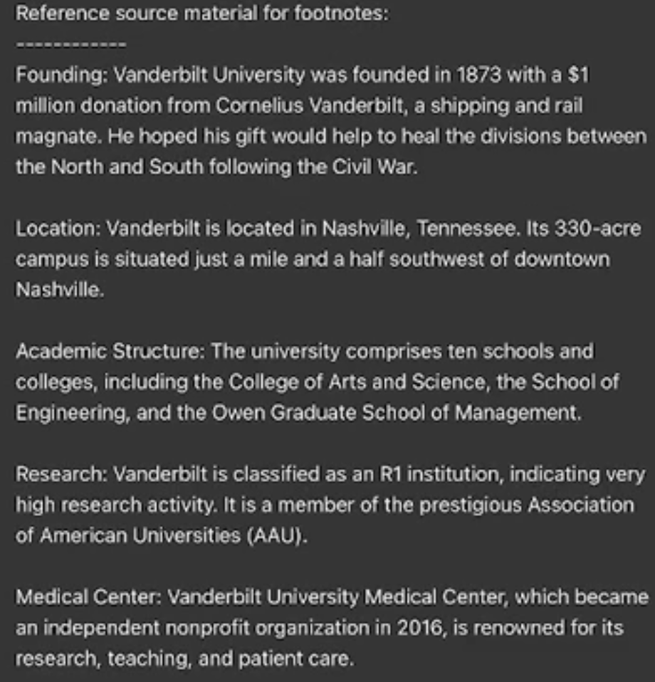
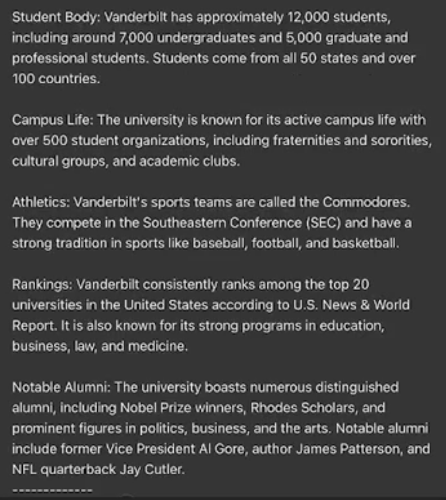
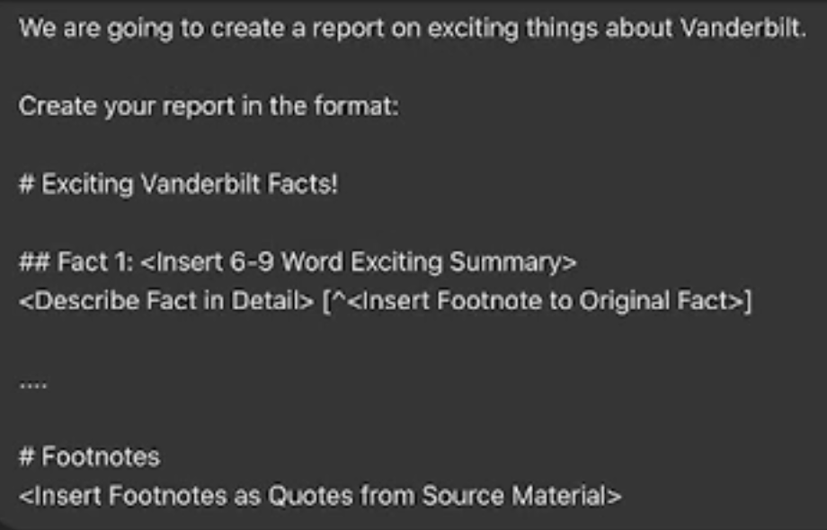
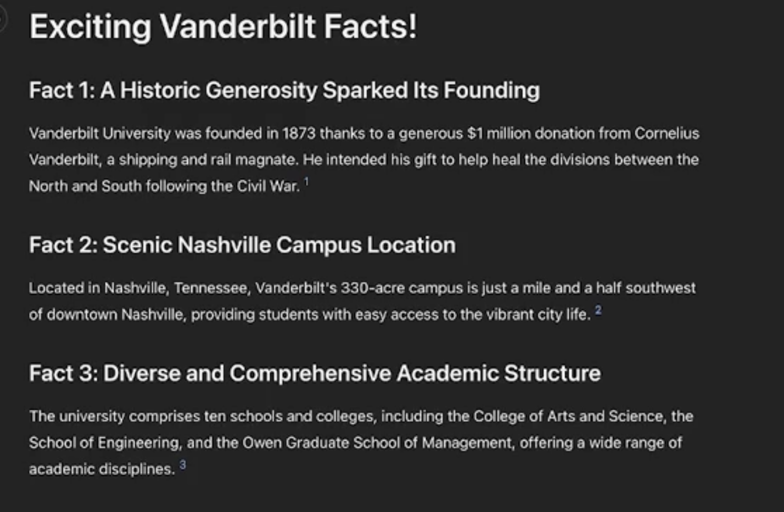
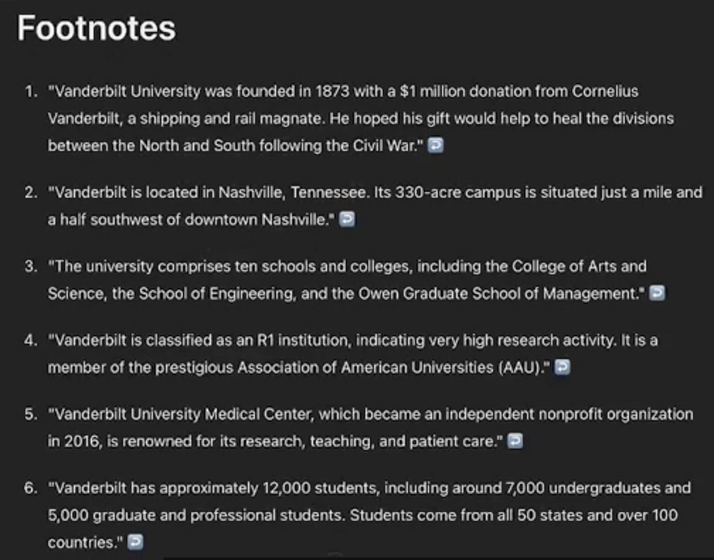

# See prompts hints here

## 1. Create report and verify its content

To create a report / summary / .. based on facts and ensure the content is correct.
### Prompt

```
Reference source material for footnotes:
---

 Provide here all the facts that should be included in the report, each fact on a new line. 

---
We are going to create on existing things (add here what facts were about:e.g. why using АI is must skill... )

Create your report in the forma:

# Exciting <??> Facts

## Fact 1 <insert 6-9 words exciting summary> [^<insert footnote to original fact>]


.... 
(here elipsis means "go and fill more facts")

# Footnotes
<insert footnotes as Quotes from Source Material.>
```


---
### Details
- We provide the facts and want to see reports. The Footnotes helps AI to keep the facts and less hallucinations.
- We have a way to verify the content - by checking the footnotes.
### Example
#### Prompt



#### Result



---
## 2.  Five ways to solve the problem

To genereate more options to solve the problem. This prompt should be used ALWAYS when we want to solve the problem.
### Prompt
- Give me 5 options to solve every problem I give you. And Compare and Contrast them.
### Details

### Example

---
## 3. Generation Approaches

### Prompt
- Consider fundamentally different approaches  to “ announce my XXXX course in Coursera”. Now, use each of those approaches to write an eMail announcement.
### Details

### Example

---

## 4. Metrics to compare and evaluate options

### Prompt
 Give me 5 metrics to compare and contrast ways of accomplishing the following task.

Find me the Evaluation criteria for ……  
And then :  evaluate the solutions using those criteria  

Put it into:
- A Table
- Evaluation Matrix
- Quadrant chart

### Details

### Example

---
## 5. Generate infographics from plain text

### Prompt
Generate infographics from plain text

"You are a world-class visual explainer and technical designer.
Transform this concept into a visual infographic using Mermaid.js or another code-based diagram format:

"[INSERT CONCEPT]"

Return
1. A flowchart, timeline, concept map, or decision tree whichever fits best.
2. A plain-language caption explaining the graphic.
3. Clean Mermaid (or HTML/SVG/CSS) code I can copy and render.

Keep it minimal, readable, and slide-ready."
### Details

### Example

---
## 6. Create McKinsey-style web presentations

“McKinsey style” involves delivering clear, structured, actionable insights to senior executives using principles like the Pyramid Principle and MECE (), ensuring effective communication.


### Prompt

PROMPT:

Act as a strategy consultant creating a web-based presentation.

Topic: [INSERT TOPIC]

Output
1. Use the pyramid principle: Problem → Insight → Recommendation.
2. Break into 6–10 concise slides, each with a bold title and 2–4 bullets.
3. Provide mobile-responsive HTML/CSS for the deck (optional).
4. Focus on clarity, insight, and executive readiness.

### Details

### Example

---
## 7. Summarize long reports and PDFs 

Summarize long reports and PDFs like a top analyst

Upload a 100-page PDF and Grok distills the essentials into an executive brief.


### Prompt

"You are a senior analyst skilled in digesting technical and academic documents.

Task
Summarize the attached document for a time-poor founder.

Focus on
• Key findings
• Crucial data points
• Strategic implications

Format
Bold headers, bullet points, plain language.
End with recommended next steps or decisions.

Target length: one page."

### Details

### Example

---
## 2. 


### Prompt

### Details

### Example

---
## 2. 


### Prompt

### Details

### Example

---
## 2. 


### Prompt

### Details

### Example

---