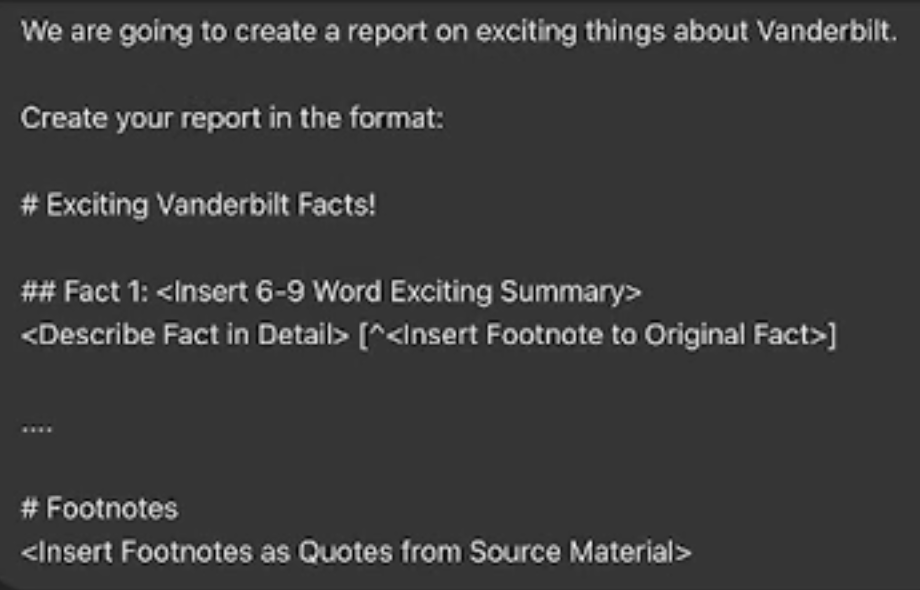
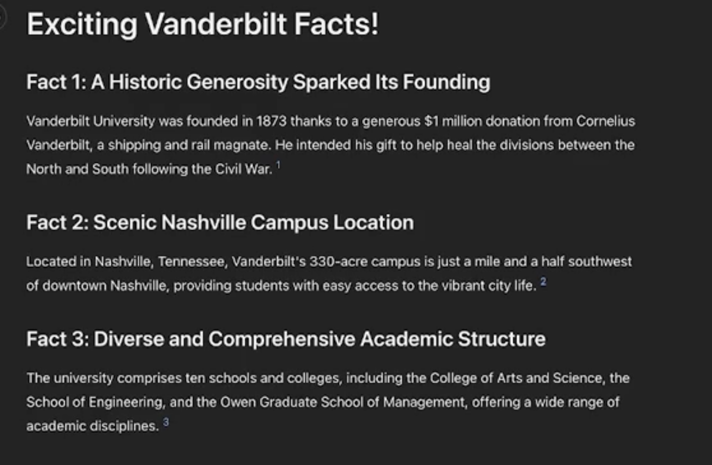
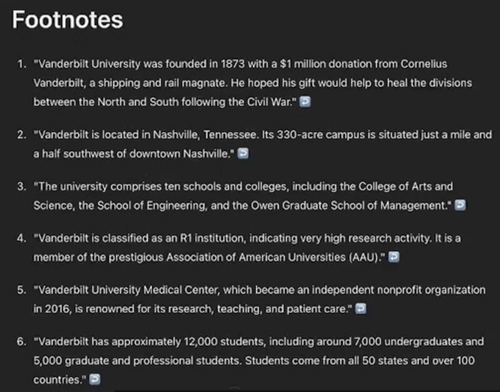

# See prompts hints here

## Create report and verify its content
### Usage
### Prompt

```
Reference source material for footnotes:
---

 Provide here all the facts that should be included in the report, each fact on a new line. 

---
We are going to create on existing things (add here what facts were about:e.g. why using АI is must skill... )

Create your report in the forma:

# Exciting <??> Facts

## Fact 1 <insert 6-9 words exciting summary> [^<insert footnote to original fact>]


.... 
(here elipsis means "go and fill more facts")

# Footnotes
<insert footnotes as Quotes from Source Material.>
```


---
### Details
- We provide the facts and want to see reports. The Footnotes helps AI to keep the facts and less hallucinations.
- We have a way to verify the content - by checking the footnotes.
### Example
#### Prompt



#### Result

